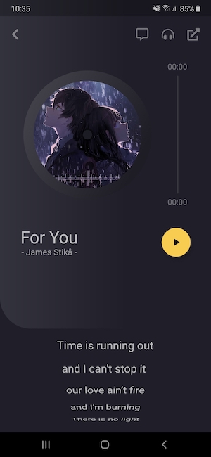

# Flutter design practice

Flutter practice to learn how to create custom animations and 
attractive designs for mobile and tablet applications.

## Applied concepts

- AnimationBuilder
- Tweens
- SingleTickerStateProvider
- Curves
- Provider (state management)
- Customizable widgets
- Responsive design
- Light and dark theme
- CustomPainter
- Slivers
- CustomSlivers
- Slideshow
- Circular progress indicators
- ScrollController
- AnimationController

## Screenshots


___

___

___

___


## Getting started

### Download

Clone or download this repository.

```bash
$ git clone https://github.com/fabirt/flutter-design-practice.git
```

### Set up

Install the dependencies specified in the `pubspec.yaml` file.

```bash
$ flutter pub get
```

### Launch the app
Launch the app in debug mode using a simulator or a connected device.

```bash
$ flutter run
```
